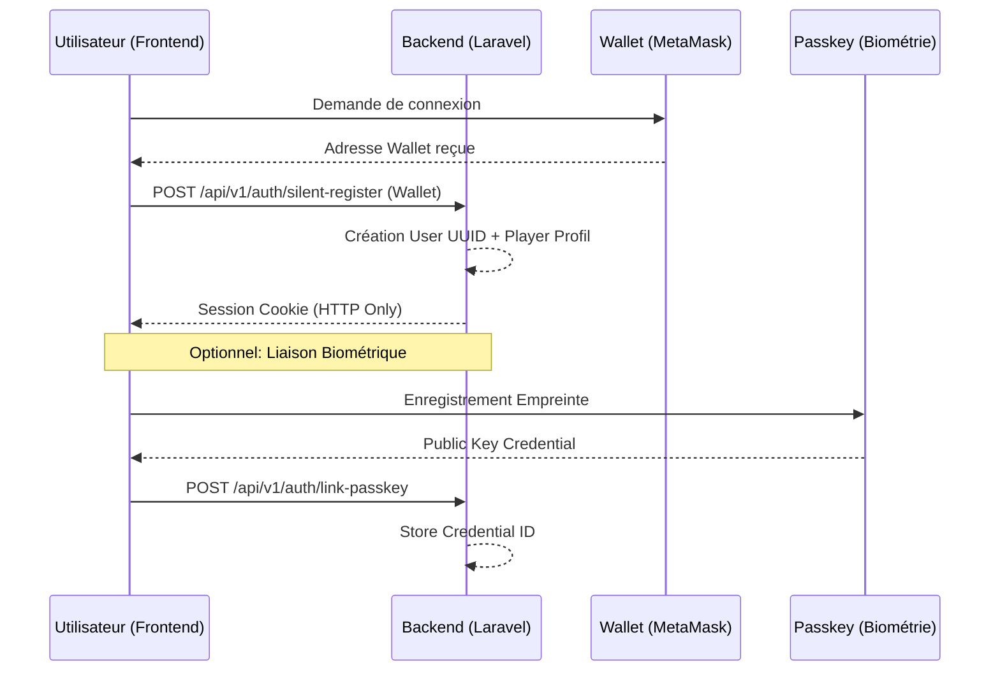

# AKWABA Backend - Architecture Web3 & Culturelle (V2)

Ce document définit l'architecture avancée du backend AKWABA, intégrant le contexte ivoirien, une authentification hybride biométrique, et une séparation stricte entre les joueurs et l'administration.

## 🔐 Système d'Authentification Hybride

### 1. Authentification Joueur (Web2.5)
- **Primary Auth**: Wallet MetaMask (Polygon).
- **Biometric Auth**: Empreinte digitale (WebAuthn/Passkeys) via Google/Apple Passkeys.
- **Session**: Laravel Sanctum avec **HTTP Only Cookies** (Protection XSS totale).
- **Inscription "Silent"**: Création du compte automatique dès la détection du wallet.

### 2. Authentification Administrateur (Traditionnel)
- **Login**: Email / Mot de passe classique.
- **Table**: `admins` (totalement séparée des `users`).

---

## 📊 Schéma de la Base de Données (22+ Tables)

### 📂 Groupe : Identité & Sécurité
1. **`users`**: Table des joueurs. Clé primaire UUID. Stocke l'adresse du wallet et les IDs de clés WebAuthn.
2. **`admins`**: Table des administrateurs. Accès au dashboard de gestion.
3. **`webauthn_credentials`**: Stocke les clés publiques d'empreintes digitales liées aux utilisateurs.
4. **`roles_permissions`**: Via Spatie, pour gérer les niveaux d'accès (Admin, Modérateur, Support).

### 📂 Groupe : Contexte Ivoirien (Patrimoine)
5. **`civilizations`**: Les 4 grands groupes (Akan, Krou, Mandé, Voltaïque) et leurs sous-groupes (Baoulé, Bété, etc.).
6. **`regions`**: Les 31 régions de Côte d'Ivoire.
7. **`communes`**: Les communes et quartiers (Focus Abidjan: Cocody, Yopougon, Marcory, etc.).
8. **`cultural_assets`**: Médias, contes et artefacts liés aux civilisations.

### 📂 Groupe : Moteur de Jeux (CRUD Admin)
9. **`games`**: Catalogue des jeux (Marelle, Génie en Herbe, La Roue).
10. **`game_marelle_configs`**: Paramètres spécifiques au jeu de la Marelle.
11. **`game_questions`**: Banque de questions centralisée, filtrable par thématique et difficulté.
12. **`game_options`**: Réponses possibles pour les questions.
13. **`game_sessions`**: Historique des parties jouées par les utilisateurs.

### 📂 Groupe : Défis & Engagement
14. **`challenges`**: Défis temporels ou géographiques (ex: "Défi de Korhogo").
15. **`challenge_user`**: Table pivot pour suivre la progression des joueurs dans les défis.
16. **`daily_rewards`**: Configuration des récompenses journalières (Day 1 to Day 7).
17. **`leaderboards`**: Classements par région, commune ou global.

### 📂 Groupe : Économie & Blockchain (Polygon)
18. **`wallets`**: Balances internes (Tokens $AKWABA non-réclamés).
19. **`pending_rewards`**: File d'attente pour la distribution des tokens par batch.
20. **`blockchain_transactions`**: Journal de toutes les interactions avec les Smart Contracts.
21. **`nfts`**: Catalogue des NFTs (ERC-1155) disponibles à l'achat.
22. **`mobile_money_tx`**: Journal des dépôts/retraits via Orange, MTN, Wave.

---

## 🔄 Flux Logique de l'Authentification

## 🇨🇮 Spécificités Côte d'Ivoire
- **Mobile Money**: Chaque transaction est liée à une référence externe (Orange/Wave) pour réconciliation.
- **Régionalisation**: Possibilité de créer des tournois limités aux joueurs d'une certaine commune (ex: "Le Champion de Yopougon").
